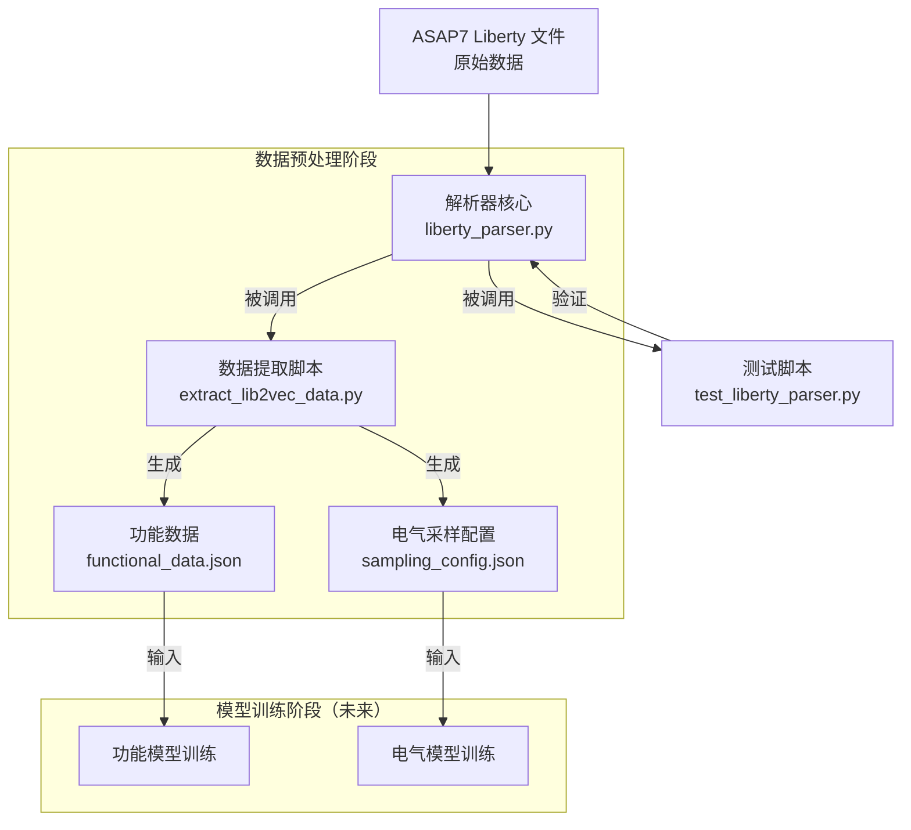

<!--
 * @Author: QT-ship 3230103073@zju.edu.cn
 * @Date: 2025-08-21 14:27:34
 * @LastEditors: QT-ship 3230103073@zju.edu.cn
 * @LastEditTime: 2025-08-22 19:22:21
 * @FilePath: \2025-SRTP-Lib2Vec\README.md
 * @Description: 这是默认设置,请设置`customMade`, 打开koroFileHeader查看配置 进行设置: https://github.com/OBKoro1/koro1FileHeader/wiki/%E9%85%8D%E7%BD%AE
-->
# 2025-SRTP-Lib2Vec
## 本项目环境
 conda环境名 Lib2Vec           文件夹/home/mingya/program_sources/miniconda3/envs/Lib2Vec/
 python3.10 环境名 Lib2Vec-env 文件夹~/Lib2Vec-env
~~source Lib2Vec-env/bin/activate 激活环境~~
~~deactivate 退出环境~~
每次工作前先运行环境配置脚本 setup_environment.sh
```shell
sorce setup_environment.sh
```
这样就无需conda activate, source Lib2Vec-env/bin/activate了

## 已安装
参见requirements.txt
~~PyTorch版本: 2.7.1+cu118 ~~
~~CUDA版本: 11.8 ~~
~~GPU设备: NVIDIA GeForce RTX 4060 Laptop GPU~~
~~NumPy版本: 2.1.2~~
~~Pandas版本: 2.3.1~~
~~Scikit-learn版本: 1.7.1~~
~~Matplotlib版本: 3.10.5~~

~~toLiberty-parser （使用未验证，未添加路径到环境变量，也不知道要不要添加）附网址：       ~~   ~~https://codeberg.org/tok/liberty-parser（论文引用17）~~

~~jupyter（可视化）~~
~~seaborn plotly ipywidgets（额外的数据处理库）~~
~~tensorboard（神经网络训练工具）~~

## 工程文件夹为 ~/lib2vec-reproduction
### 项目结构
```bash
lib2vec-reproduction/
├── data/                 # 存放原始数据或处理后的数据
├── models/               # 存放训练好的模型
├── results/              # 存放实验结果
├── scripts/              # 存放主要脚本
│   ├── data_processing.py
│   ├── model_training.py
│   └── evaluation.py
└── utils/                # 存放工具模块
    ├── liberty_parser.py
    ├── data_generator.py
    └── visualization.py
```



